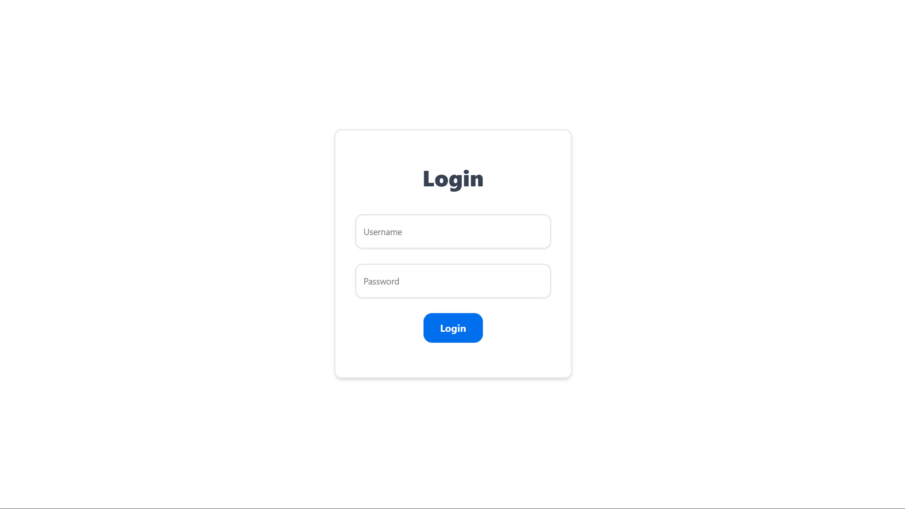
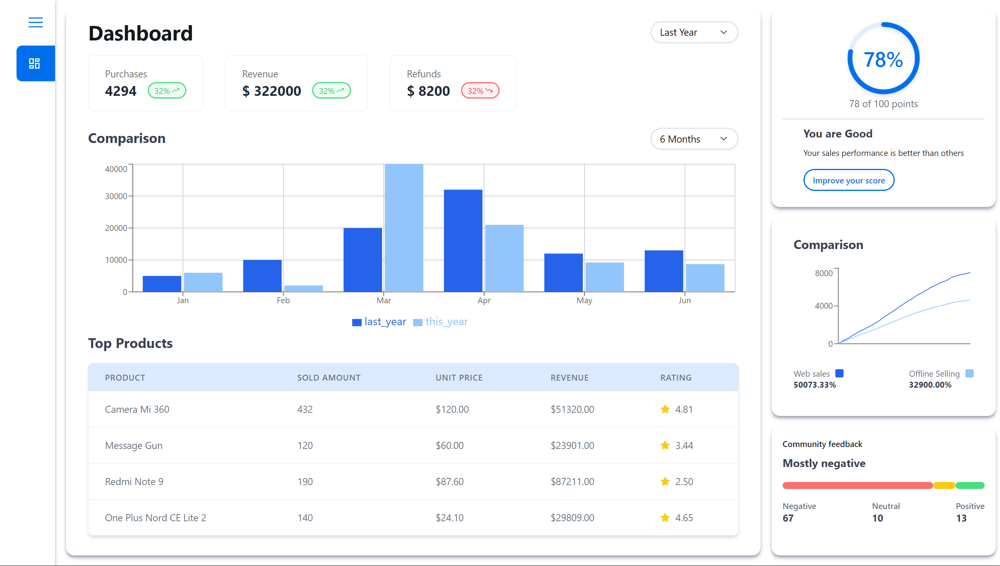

# Dashboard App

## Screenshots



*Login*


*Dashboard*

## Prerequisites

Before you begin, ensure you have met the following requirements:
* You have installed the latest version of [Node.js and npm](https://nodejs.org/en/download/)
* You have a Windows/Linux/Mac machine.

## Installing Dashboard App

To install the project, follow these steps:

1. Clone the repository:
   ```
   git clone https://github.com/ankit-kr27/dashboard.git
   ```
2. Navigate to the project directory:
   ```
   cd client
   ```
3. Install the dependencies:
   ```
   npm install
   ```

## Using the Dashboard App

To use the app, follow these steps:

1. Move to client directory:
   ```
   cd client
   ```
2. Start the development server:
   ```
   npm run dev
   ``` 
3. Open your web browser and visit `http://localhost:5173` (or the port shown in your terminal)

To build the app for production:
```
npm run build
```

To preview the production build:
```
npm run preview
```


## Contact

If you want to contact me, you can reach me at `ankitkr2731@gmail.com`.
